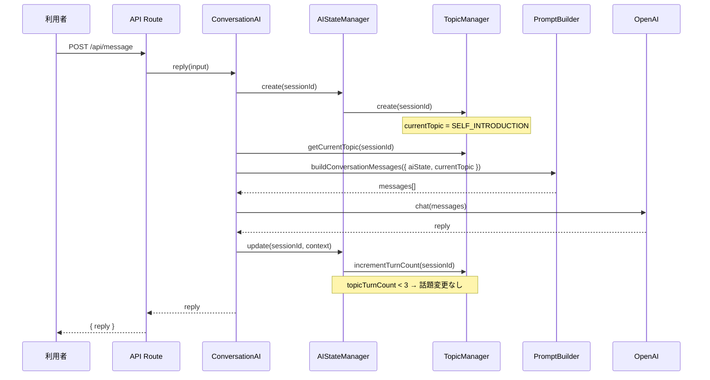
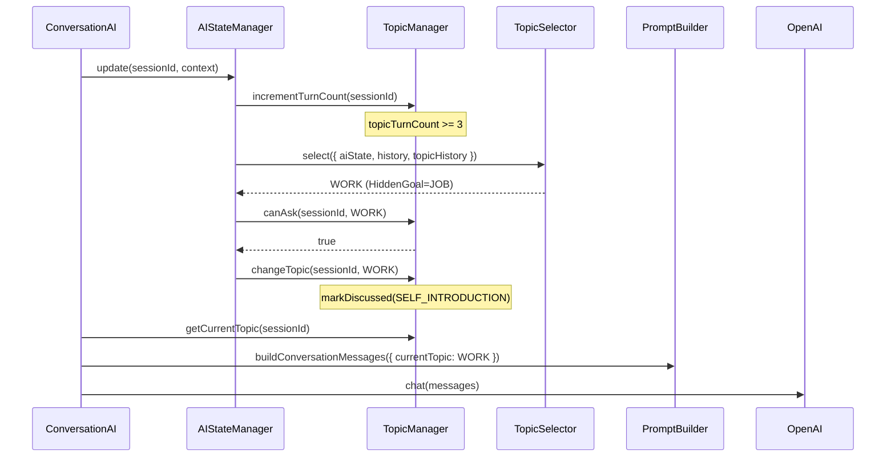

# 14_話題管理設計.md

# 婚活AIトレーナー

Version: 1.0

---

# 1. 設計方針

**TopicManager** は、AI 女性の「話題選択」をアプリケーション側で管理するモジュールである。

OpenAI に話題を考えさせるのではなく、TopicManager が現在の話題を決定し、PromptBuilder 経由で OpenAI に指示する。

## 基本原則

| 原則 | 説明 |
| --- | --- |
| 話題はアプリが管理する | OpenAI は与えられた話題を自然に深掘りするだけ |
| HiddenGoal と連携 | 非公開目標に向かって話題を誘導する |
| 繰り返し防止 | 同じ話題を短時間で繰り返さない |
| 責務分離 | 保持（Manager）・選択（Selector）・参照（PromptBuilder）を分離 |

## 関連設計書

| 設計書 | 関係 |
| --- | --- |
| `05_AI設計.md` | Hidden Goal・会話ルール |
| `13_AI状態設計.md` | AIStateManager との連携 |
| `06_プロンプト設計.md` | Prompt への話題埋め込み |

---

# 2. Topic 一覧

## 2.1 Enum 定義

```typescript
enum Topic {
  SELF_INTRODUCTION = "SELF_INTRODUCTION",
  WORK = "WORK",
  HOLIDAY = "HOLIDAY",
  HOBBY = "HOBBY",
  FOOD = "FOOD",
  TRAVEL = "TRAVEL",
  FAMILY = "FAMILY",
  MARRIAGE = "MARRIAGE",
  VALUES = "VALUES",
  LOVE = "LOVE",
  FUTURE = "FUTURE",
  LIFESTYLE = "LIFESTYLE",
  PET = "PET",
  OTHER = "OTHER",
}
```

## 2.2 表示ラベル（Prompt 用）

| Topic | 日本語ラベル |
| --- | --- |
| `SELF_INTRODUCTION` | 自己紹介 |
| `WORK` | 仕事 |
| `HOLIDAY` | 休日 |
| `HOBBY` | 趣味 |
| `FOOD` | 食べ物 |
| `TRAVEL` | 旅行 |
| `FAMILY` | 家族 |
| `MARRIAGE` | 結婚観 |
| `VALUES` | 価値観 |
| `LOVE` | 恋愛観 |
| `FUTURE` | 将来 |
| `LIFESTYLE` | ライフスタイル |
| `PET` | ペット |
| `OTHER` | その他 |

---

# 3. TopicHistory

## 3.1 構造

```typescript
interface TopicHistory {
  currentTopic: Topic;       // 現在の話題
  previousTopics: Topic[];   // 過去に話した話題（時系列）
  discussedTopics: Topic[];  // 十分に話した話題
  lastChangedAt: Date;       // 最後に話題が変わった日時
  topicTurnCount: number;    // 現在の話題でのターン数
}
```

## 3.2 初期値

| フィールド | 初期値 |
| --- | --- |
| `currentTopic` | `SELF_INTRODUCTION` |
| `previousTopics` | `[]` |
| `discussedTopics` | `[]` |
| `lastChangedAt` | セッション開始日時 |
| `topicTurnCount` | `0` |

## 3.3 更新ルール

| イベント | 更新内容 |
| --- | --- |
| 会話ターン終了 | `topicTurnCount++` |
| 話題変更 | `currentTopic` 更新、`previousTopics` に追加、`topicTurnCount = 0`、`lastChangedAt` 更新 |
| 話題完了 | `discussedTopics` に追加 |

---

# 4. TopicManager 責務

## 4.1 概要

`TopicManager` は **話題状態のライフサイクル管理** を担当する。

## 4.2 公開メソッド

```typescript
class TopicManager {
  create(sessionId: string): TopicHistory;
  getTopicHistory(sessionId: string): TopicHistory | undefined;
  getCurrentTopic(sessionId: string): Topic;
  changeTopic(sessionId: string, newTopic: Topic): TopicHistory;
  markDiscussed(sessionId: string, topic?: Topic): void;
  canAsk(sessionId: string, topic: Topic): boolean;
  incrementTurnCount(sessionId: string): void;
  reset(sessionId: string): void;
}
```

## 4.3 canAsk() ルール

同じ話題を短時間で繰り返さないための判定。

| 条件 | 結果 |
| --- | --- |
| 提案話題 ≠ 現在話題 | `true`（変更可能） |
| 提案話題 = 現在話題 かつ `topicTurnCount < 3` | `false`（繰り返し禁止） |
| 提案話題 = 現在話題 かつ `topicTurnCount >= 3` | `true` |

例：`WORK → WORK → WORK`（3 ターン未満）は禁止。

## 4.4 保持場所

| フェーズ | 保持場所 |
| --- | --- |
| MVP（現状） | サーバーインメモリ（`Map<sessionId, TopicHistory>`） |
| 将来 | `ConversationSession` JSON カラムへ永続化 |

---

# 5. TopicSelector 責務

## 5.1 概要

`TopicSelector` は **次に話す話題を選択する** 純粋な選択モジュールである。

状態を保持しない。副作用を持たない。

## 5.2 入力・出力

```typescript
interface TopicSelectorInput {
  aiState: AIState;
  conversationHistory: ConversationHistoryMessage[];
  topicHistory: TopicHistory;
}

class TopicSelector {
  select(input: TopicSelectorInput): Topic;
}
```

## 5.3 選択優先順位

| 優先度 | ルール | 説明 |
| --- | --- | --- |
| ① | HiddenGoal | `AIState.hiddenGoal` に対応する Topic を優先（未議論の場合） |
| ② | 未議論話題 | `discussedTopics` に含まれない Topic |
| ③ | 盛り上がり話題 | `interest >= 60` または `satisfaction >= 60` の場合、現在 Topic を継続 |
| ④ | ランダム | 上記に該当しない場合、現在以外からランダム選択 |

## 5.4 変更タイミング

`topicTurnCount >= 3` のときのみ `AIStateManager` が `TopicSelector` を呼び出し、話題変更を検討する。

---

# 6. AIStateManager との連携

## 6.1 依存関係

```text
AIStateManager
  ├── TopicManager（保持）
  └── TopicSelector（選択）
```

`AIStateManager` は `TopicManager` を注入し、会話成功後に話題更新を委譲する。

## 6.2 処理フロー

```text
create(sessionId)
  → AIState 生成
  → TopicManager.create(sessionId)   … 初期話題 SELF_INTRODUCTION

update(sessionId, context)
  → AIState 更新（conversationCount, tension, comfort）
  → TopicManager.incrementTurnCount(sessionId)
  → topicTurnCount >= 3 の場合
      → TopicSelector.select()
      → TopicManager.changeTopic()
```

## 6.3 reset 連携

```text
AIStateManager.reset(sessionId)
  → TopicManager.reset(sessionId)
```

---

# 7. PromptBuilder との連携

## 7.1 入力拡張

```typescript
interface BuildConversationMessagesInput {
  session: Session;
  aiState: AIState;
  currentTopic: Topic;              // TopicManager から取得
  conversationHistory: ConversationHistoryMessage[];
  latestMessage: string;
}
```

## 7.2 テンプレート埋め込み

`src/prompts/conversation/system.md` へ以下を追加する。

| プレースホルダー | 内容 |
| --- | --- |
| `{{current_topic}}` | 現在話題の日本語ラベル |
| `{{current_topic_instruction}}` | 「この話題を自然に深掘りしてください」等の指示文 |

## 7.3 例

```text
現在の話題

現在の話題は「仕事」です。この話題を自然に深掘りしてください。
```

---

# 8. HiddenGoal との連携

## 8.1 対応表

| HiddenGoal | Topic |
| --- | --- |
| `JOB` | `WORK` |
| `HOLIDAY` | `HOLIDAY` |
| `MARRIAGE` | `MARRIAGE` |
| `FAMILY` | `FAMILY` |
| `HOBBY` | `HOBBY` |
| `VALUE` | `VALUES` |
| `FOOD` | `FOOD` |
| `TRAVEL` | `TRAVEL` |
| `FUTURE` | `FUTURE` |
| `LOVE` | `LOVE` |

## 8.2 連携ルール

| ルール | 説明 |
| --- | --- |
| 優先誘導 | TopicSelector は HiddenGoal 対応 Topic を最優先で選択 |
| 非公開 | Prompt には Goal 自体は書くが、利用者への返答で明かさない |
| 自然な深掘り | 話題を急に変えず、現在 Topic から自然に関連話題へ |

---

# 9. 将来 Memory と連携する方法

## 9.1 連携方針

Memory に蓄積された Fact / Insight を TopicSelector の入力に追加する。

```typescript
interface TopicSelectorInput {
  aiState: AIState;
  conversationHistory: ConversationHistoryMessage[];
  topicHistory: TopicHistory;
  memory: MemoryState;           // 将来追加
}
```

## 9.2 活用例

| Memory 内容 | Topic 選択への影響 |
| --- | --- |
| Fact: 「犬を飼っている」 | `PET` 話題を優先 |
| Insight: 「アウトドア好き」 | `HOBBY` / `TRAVEL` を優先 |
| Fact: 「IT企業勤務」 | `WORK` の深掘りを継続 |

## 9.3 変更箇所

| モジュール | 変更内容 |
| --- | --- |
| `TopicSelector` | Memory 参照ロジック追加 |
| `AIStateManager.update()` | Memory を Selector へ渡す |
| `TopicManager` | Memory ベースの `markDiscussed` 自動化 |

---

# 10. 将来 LLM 判定へ置き換える方法

## 10.1 置き換え方針

`TopicSelector` のルールベース選択を、LLM 構造化出力に段階的に置き換える。

```typescript
// 将来
class TopicSelector {
  select(input: TopicSelectorInput): Topic {
    // ルールベース（フォールバック）
    const ruleBased = this.selectByRules(input);
    // LLM 判定（優先）
    const llmBased = await this.selectByLLM(input);
    return llmBased ?? ruleBased;
  }
}
```

## 10.2 LLM 入力

- AIState（心理状態）
- TopicHistory（話題履歴）
- ConversationHistory（直近会話）
- HiddenGoal 対応 Topic

## 10.3 LLM 出力（Structured Output）

```json
{
  "nextTopic": "WORK",
  "reason": "相手の仕事についてもう少し聞きたい",
  "shouldChange": true
}
```

## 10.4 移行フェーズ

| フェーズ | 方式 |
| --- | --- |
| Phase2-3（現状） | ルールベースのみ |
| Phase3 | ルール + LLM 併用（LLM 優先） |
| Phase4 | LLM のみ（ルールはフォールバック） |

---

# 11. シーケンス図

## 11.1 会話開始〜初回返信



## 11.2 話題変更（3 ターン後）



---

# 12. モジュール構成

```text
src/ai/topic/
├── Topic.ts           … Enum・ラベル・HiddenGoal 対応表
├── TopicHistory.ts    … 型定義・初期値
├── TopicManager.ts    … ライフサイクル管理
├── TopicSelector.ts   … 話題選択ロジック
└── index.ts
```

---

# 13. 設計思想

話題選択は AI の「意志」として振る舞うべきであるが、
その意志自体はアプリケーションが管理する。

OpenAI は与えられた話題・心理状態・HiddenGoal をもとに、
一人の婚活女性として自然な返答を生成する。

TopicManager により、
・HiddenGoal への誘導
・話題の重複防止
・会話の自然な流れ

をコードで保証し、Prompt 品質の安定化を図る。
