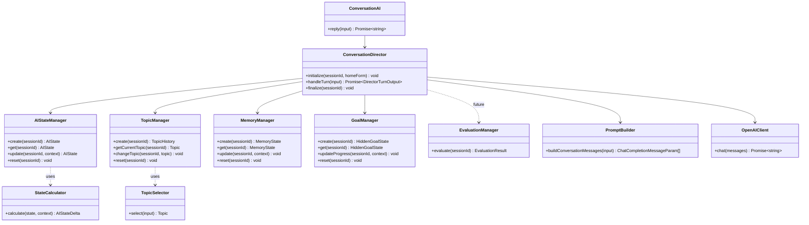
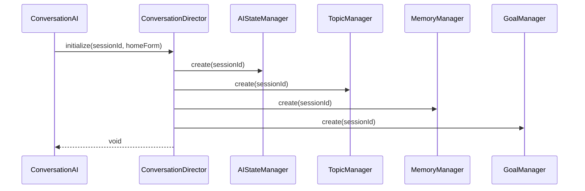
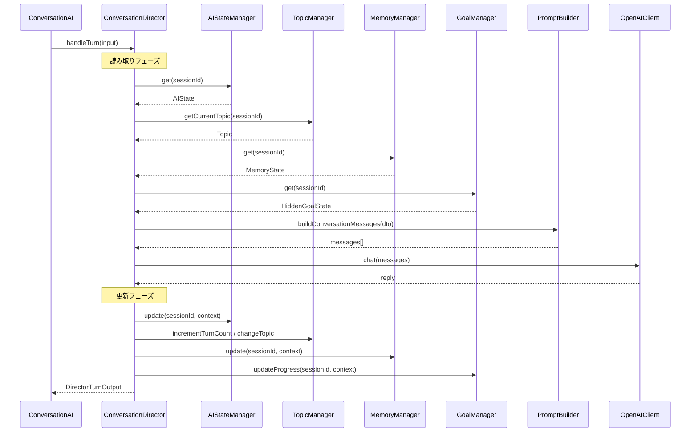
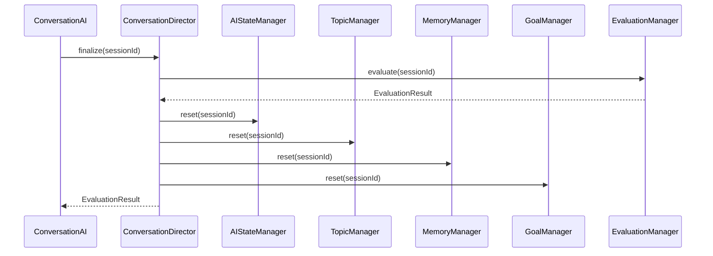

# 15_会話ディレクター設計.md

# 婚活AIトレーナー

Version: 1.0

---

# 1. 目的

## 1.1 ConversationDirector とは

**ConversationDirector** は、婚活 AI 会話エンジン全体を統括する**司令塔（Orchestrator）** である。

各 Manager へ処理を委譲し、収集した情報を **PromptBuilder** へ渡して OpenAI 呼び出しを行う。
会話成功後、各 Manager の更新処理を順番に実行する。

## 1.2 責務

| 責務 | 説明 |
| --- | --- |
| オーケストレーション | 会話 1 ターンの処理フローを定義し、各 Manager を順番に呼び出す |
| 情報の集約 | 各 Manager から取得した状態を PromptBuilder 入力用 DTO にまとめる |
| OpenAI 呼び出しの調整 | PromptBuilder → OpenAIClient の呼び出しを実行する |
| 更新フローの制御 | OpenAI 返答後、State / Topic / Memory / Goal の更新順序を管理する |
| セッション初期化 | 会話開始時に各 Manager の `create()` を呼び出す |

## 1.3 責務外（やってはいけないこと）

| 禁止事項 | 理由 |
| --- | --- |
| 状態の保持 | 状態の正は各 Manager が持つ。Director はステートレス |
| ビジネスロジックの実装 | 心理計算・話題選択・記憶更新は各 Manager / Calculator が担当 |
| Repository の直接利用 | 永続化は各 Manager 経由（`08_データベース設計.md` 準拠） |
| Manager 同士の直接呼び出し | 依存の複雑化を防ぐため、Director のみが Manager を呼ぶ |
| Prompt 文字列の生成 | PromptBuilder の責務 |

## 1.4 既存実装との関係

現状、`ConversationAI` が `AIStateManager`・`TopicManager`・`PromptBuilder`・`OpenAIClient` を直接呼び出している。
Phase2-4 以降、`ConversationAI` は薄いファサードとし、実処理は `ConversationDirector` へ移譲する。

```text
【現状】
ConversationAI → AIStateManager / TopicManager / PromptBuilder / OpenAIClient

【目標】
ConversationAI → ConversationDirector → Managers / PromptBuilder / OpenAIClient
```

## 1.5 関連設計書

| 設計書 | 関係 |
| --- | --- |
| `05_AI設計.md` | Conversation Engine 全体構成 |
| `13_AI状態設計.md` | AIStateManager 設計 |
| `14_話題管理設計.md` | TopicManager 設計 |
| `06_プロンプト設計.md` | PromptBuilder 連携 |
| `09_プロジェクト構成.md` | 依存方向・責務分離 |

---

# 2. アーキテクチャ

## 2.1 全体構成

```text
ConversationAI（ファサード / API 境界）
        │
        ▼
ConversationDirector（司令塔・ステートレス）
        │
        ├─► AIStateManager      … 心理状態管理
        ├─► TopicManager        … 話題管理
        ├─► MemoryManager       … 会話記憶（将来実装）
        ├─► GoalManager         … HiddenGoal 管理（将来分離）
        ├─► EvaluationManager   … 評価生成（将来実装）
        │
        ├─► PromptBuilder       … messages[] 生成
        └─► OpenAIClient        … API 呼び出し
```

## 2.2 データフロー（1 ターン）

```text
【読み取りフェーズ】
State 取得 → Topic 取得 → Memory 取得 → Goal 取得
        → PromptBuilder → OpenAI

【更新フェーズ】
State 更新 → Topic 更新 → Memory 更新 → Goal 更新
        → 返答
```

## 2.3 依存方向

```text
UI / API Route
    ↓
ConversationAI
    ↓
ConversationDirector
    ↓
Managers（AIState / Topic / Memory / Goal）
    ↓
Repository（将来・各 Manager 内）
    ↓
Database

ConversationDirector
    ↓
PromptBuilder → OpenAIClient → OpenAI
```

**Repository から AI を呼ばない。Manager 同士を直接呼ばない。**

---

# 3. Manager 責務

## 3.1 一覧

| Manager | 責務 | 実装状況 |
| --- | --- | --- |
| **AIStateManager** | 心理状態（Relationship / Emotion / Conversation 等）の保持・更新 | Phase2-2 実装済 |
| **TopicManager** | 現在話題・話題履歴の保持・更新・繰り返し防止 | Phase2-3 実装済 |
| **MemoryManager** | Fact / Insight の蓄積・参照・重複排除 | 未実装（設計済） |
| **GoalManager** | HiddenGoal の生成・進捗・達成判定 | 未実装（AIState 内に暫定） |
| **EvaluationManager** | 会話終了後の評価生成・EvaluationResult 管理 | 未実装（将来） |

## 3.2 AIStateManager

| 項目 | 内容 |
| --- | --- |
| 管理対象 | `AIState`（心理状態・会話ターン数など） |
| 公開操作 | `create()` / `get()` / `update()` / `reset()` |
| 計算委譲 | `StateCalculator`（将来） |
| DB 対応 | `emotion` / `impression` JSON カラム |

## 3.3 TopicManager

| 項目 | 内容 |
| --- | --- |
| 管理対象 | `TopicHistory`（現在話題・議論済み話題など） |
| 公開操作 | `create()` / `getCurrentTopic()` / `changeTopic()` / `markDiscussed()` / `canAsk()` / `reset()` |
| 選択委譲 | `TopicSelector` |
| DB 対応 | 将来 `ConversationSession` へ JSON 永続化 |

## 3.4 MemoryManager

| 項目 | 内容 |
| --- | --- |
| 管理対象 | `MemoryState`（`facts[]` / `insights[]`） |
| 公開操作（予定） | `create()` / `get()` / `addFact()` / `addInsight()` / `reset()` |
| 更新委譲 | `MemoryExtractor`（将来・ルール or LLM） |
| DB 対応 | `memory` JSON カラム（`08_データベース設計.md`） |

## 3.5 GoalManager

| 項目 | 内容 |
| --- | --- |
| 管理対象 | `HiddenGoalState`（category / description / progress / achieved） |
| 公開操作（予定） | `create()` / `get()` / `updateProgress()` / `markAchieved()` / `reset()` |
| 生成委譲 | `GoalGenerator`（セッション開始時ランダム生成） |
| DB 対応 | `hiddenGoal` JSON カラム |
| 備考 | 現状は `AIStateManager` 内の `HiddenGoal` Enum で暫定管理。Phase3 で分離 |

## 3.6 EvaluationManager（将来）

| 項目 | 内容 |
| --- | --- |
| 管理対象 | `EvaluationResult` |
| 公開操作（予定） | `evaluate()` / `get()` / `save()` |
| AI 委譲 | `EvaluationAI` |
| トリガー | `ConversationDirector` が会話終了を検知したとき |
| DB 対応 | `Evaluation` テーブル |

---

# 4. ConversationDirector 責務

## 4.1 基本方針

ConversationDirector は **各 Manager を順番に呼び出すだけ** のオーケストレーターである。

**自身は状態を保持しない（ステートレス）。**

## 4.2 公開メソッド（設計）

```typescript
class ConversationDirector {
  constructor(
    private readonly aiStateManager: AIStateManager,
    private readonly topicManager: TopicManager,
    private readonly memoryManager: MemoryManager,
    private readonly goalManager: GoalManager,
    private readonly promptBuilder: PromptBuilder,
    private readonly openAIClient: OpenAIClient,
  ) {}

  /** セッション初期化（会話開始時） */
  initialize(sessionId: string, homeForm: HomeForm): void;

  /** 1 ターンの会話処理 */
  handleTurn(input: DirectorTurnInput): Promise<DirectorTurnOutput>;

  /** セッション終了・リソース解放 */
  finalize(sessionId: string): void;
}
```

## 4.3 handleTurn() 処理順序

### 読み取りフェーズ

| 順序 | 処理 | 呼び出し先 |
| --- | --- | --- |
| 1 | 心理状態取得 | `AIStateManager.get()` |
| 2 | 現在話題取得 | `TopicManager.getCurrentTopic()` |
| 3 | 記憶取得 | `MemoryManager.get()` |
| 4 | HiddenGoal 取得 | `GoalManager.get()` |
| 5 | Prompt 生成 | `PromptBuilder.buildConversationMessages()` |
| 6 | OpenAI 呼び出し | `OpenAIClient.chat()` |

### 更新フェーズ

| 順序 | 処理 | 呼び出し先 |
| --- | --- | --- |
| 7 | 心理状態更新 | `AIStateManager.update()` |
| 8 | 話題更新 | `TopicManager`（increment / changeTopic） |
| 9 | 記憶更新 | `MemoryManager.update()` |
| 10 | Goal 進捗更新 | `GoalManager.updateProgress()` |
| 11 | 返答返却 | `DirectorTurnOutput` |

## 4.4 入力・出力 DTO

```typescript
interface DirectorTurnInput {
  session: Session;
  conversationHistory: ConversationHistoryMessage[];
  latestMessage: string;
}

interface DirectorTurnOutput {
  reply: string;
  shouldEnd: boolean;       // 将来: ConversationState から
  endReason?: string;
}
```

## 4.5 Director が保持してはいけないもの

- `AIState` / `TopicHistory` / `MemoryState` / `HiddenGoalState`
- 会話履歴のコピー（参照のみ）
- OpenAI レスポンスのキャッシュ

すべて各 Manager が `sessionId` をキーに保持する。

---

# 5. 処理シーケンス（テキスト）

```text
Conversation 開始
    ↓
ConversationDirector.initialize()
    ├─ AIStateManager.create()
    ├─ TopicManager.create()
    ├─ MemoryManager.create()
    └─ GoalManager.create()
    ↓
【各ターン】
ConversationDirector.handleTurn()
    ↓
State 取得        … AIStateManager.get()
    ↓
Topic 取得        … TopicManager.getCurrentTopic()
    ↓
Memory 取得       … MemoryManager.get()
    ↓
Goal 取得         … GoalManager.get()
    ↓
PromptBuilder     … buildConversationMessages()
    ↓
OpenAI            … OpenAIClient.chat()
    ↓
State 更新        … AIStateManager.update()
    ↓
Topic 更新        … TopicManager（increment / changeTopic）
    ↓
Memory 更新       … MemoryManager.update()
    ↓
Goal 更新         … GoalManager.updateProgress()
    ↓
返答              … DirectorTurnOutput
```

---

# 6. 将来追加予定

| 機能 | 概要 | 担当 |
| --- | --- | --- |
| Emotion 解析 | 利用者発言から感情反応を推定 | `StateCalculator` + `AIStateManager` |
| LLM による State 更新 | 構造化出力で心理状態を更新 | `StateCalculator` |
| 長期記憶 | セッション跨ぎの記憶保持 | `MemoryManager` + Repository |
| 複数 HiddenGoal | 優先順位付き Goal リスト | `GoalManager` |
| 評価 AI | 会話終了後の Evaluation 生成 | `EvaluationManager` + `EvaluationAI` |
| 音声評価 | トーン・速度などの音声分析 | `EvaluationManager`（Phase4） |

ConversationDirector 自体の変更は最小限とし、新 Manager の呼び出しを `handleTurn()` に追加するだけで対応できる設計とする。

---

# 7. 責務分離

## 7.1 原則

| 原則 | 説明 |
| --- | --- |
| Director のみが Manager を呼ぶ | Manager 同士の直接依存を禁止 |
| Manager はステートの正 | 各 Manager が単一責任で状態を保持 |
| Calculator / Selector は副作用なし | 純粋関数として Manager から呼ばれる |
| PromptBuilder は参照のみ | 状態を更新しない |
| OpenAIClient は通信のみ | ビジネスロジックを持たない |

## 7.2 禁止される依存

```text
❌ TopicManager → AIStateManager
❌ MemoryManager → GoalManager
❌ AIStateManager → TopicManager（現状の暫定実装は Phase3 で解消）
❌ ConversationDirector → Repository
❌ PromptBuilder → OpenAIClient
❌ Manager → OpenAIClient
```

## 7.3 許可される依存

```text
✅ ConversationDirector → すべての Manager
✅ ConversationDirector → PromptBuilder / OpenAIClient
✅ AIStateManager → StateCalculator
✅ TopicManager → TopicSelector
✅ MemoryManager → MemoryExtractor（将来）
✅ GoalManager → GoalGenerator（将来）
✅ Manager → Repository（将来・永続化時）
```

---

# 8. 将来 DB 保存

## 8.1 方針

ConversationDirector は **Repository を直接利用しない**。

各 Manager が自身の状態を Repository 経由で永続化する。

## 8.2 永続化マッピング

| Manager | Repository | DB カラム |
| --- | --- | --- |
| AIStateManager | `SessionRepository` | `emotion` / `impression` / `currentTurn` 等 |
| TopicManager | `SessionRepository` | 将来 JSON フィールド追加 |
| MemoryManager | `SessionRepository` | `memory` |
| GoalManager | `SessionRepository` | `hiddenGoal` |
| EvaluationManager | `EvaluationRepository` | `Evaluation.result` |

## 8.3 保存タイミング

| タイミング | 処理 |
| --- | --- |
| 毎ターン終了後 | 各 Manager が `save(sessionId)` を実行 |
| 会話終了時 | `finalize()` で最終状態を保存 |
| セッション破棄時 | 各 Manager が `reset()` + DB ステータス更新 |

ConversationDirector は `finalize()` 内で各 Manager の `save()` を順番に呼び出すのみ。

---

# 9. クラス図



---

# 10. シーケンス図

## 10.1 会話開始（initialize）



## 10.2 1 ターン処理（handleTurn）



## 10.3 会話終了（finalize）



---

# 11. ディレクトリ構成（実装予定）

```text
src/ai/
├── ConversationAI.ts           … API 境界ファサード
├── ConversationDirector.ts     … 司令塔（本設計）
├── PromptBuilder.ts
├── OpenAIClient.ts
├── state/
│   ├── AIStateManager.ts
│   └── StateCalculator.ts
├── topic/
│   ├── TopicManager.ts
│   └── TopicSelector.ts
├── memory/                     … 将来
│   └── MemoryManager.ts
├── goal/                       … 将来
│   └── GoalManager.ts
└── evaluation/                 … 将来
    └── EvaluationManager.ts
```

---

# 12. ConversationDirector を採用するメリット

## 12.1 オーケストレーションの一元化

会話 1 ターンの処理順序（取得 → 生成 → 更新）が **1 箇所に集約** される。
`ConversationAI` や API Route に散らばった制御ロジックを排除できる。

## 12.2 ステートレスな司令塔

Director 自身は状態を持たないため、

- テストが容易（Manager をモックしてフローだけ検証可能）
- サーバーレス環境でも再入可能
- バグの原因が「どの Manager の状態か」に限定される

## 12.3 Manager 追加が容易

`MemoryManager` や `GoalManager` を追加するとき、
`handleTurn()` の読み取り・更新フェーズに呼び出しを足すだけで済む。
既存 Manager や PromptBuilder のインターフェースを変更する必要がない。

## 12.4 責務分離の強制

「Manager 同士を直接呼ばない」ルールがアーキテクチャレベルで保証される。
`AIStateManager` 内に `TopicManager` 更新が混在する暫定実装を解消し、
各 Manager が単一責任を維持できる。

## 12.5 Prompt 品質の安定化

Director が全 Manager から情報を集約してから PromptBuilder へ渡すため、
**Prompt 生成に必要なコンテキストが常に揃った状態** で OpenAI を呼び出せる。
欠落した心理状態や話題情報による品質低下を防ぐ。

## 12.6 将来拡張への耐性

Emotion 解析・LLM State 更新・長期記憶・複数 HiddenGoal・評価 AI など、
Phase3 以降の機能を Director のフローに段階的に組み込める。
Conversation Engine 全体の**拡張ポイントが明確**になる。

## 12.7 DB 永続化との整合

Director は Repository を知らず、各 Manager が永続化を担当する。
`09_プロジェクト構成.md` の依存方向（Service → Repository → DB）と矛盾せず、
Manager 単位での永続化戦略を独立して進化できる。

---

# 13. 設計思想

ConversationDirector は「AI を呼ぶクラス」ではない。

**一人の婚活女性として振る舞うために必要なすべての内部状態を整え、
OpenAI に渡し、返答後に状態を更新する会話エンジンの心臓部** である。

OpenAI は演技者。Manager は記憶と心理。Director は演出家。

この分離により、婚活 AI トレーナーは
「プロンプトを工夫するチャットボット」ではなく
「状態を持つ会話エンジン」として進化できる。
