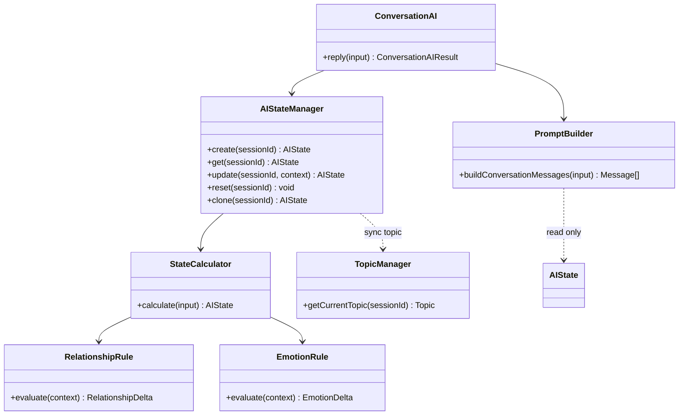
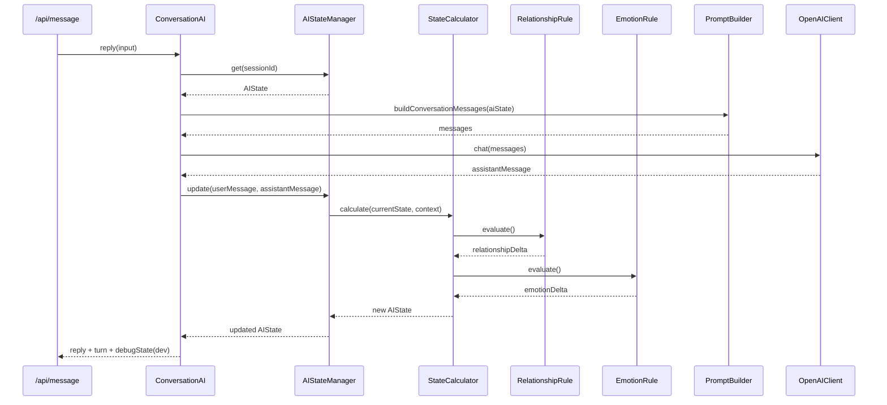

# 16_AI状態管理設計_V2.md

# 婚活AIトレーナー — AIStateManager V2

Version: 2.0

---

# 1. State構造

## 1.1 概要

V2 では AI 女性の心理状態を **Relationship（関係性）** と **Emotion（感情）** に分離し、会話進行・Hidden Goal をネスト構造で管理する。

```typescript
interface AIState {
  relationship: {
    interest: number;   // 興味 0-100
    trust: number;      // 信頼 0-100
    comfort: number;    // 安心感 0-100
    romance: number;    // 恋愛対象 0-100
  };
  emotion: {
    happy: number;      // 楽しさ 0-100
    curious: number;    // 好奇心 0-100
    nervous: number;    // 緊張 0-100
    surprised: number;  // 驚き 0-100
  };
  conversation: {
    turn: number;
    currentTopic: string;
    lastTopic?: string;
  };
  hiddenGoal: {
    type: string;       // HiddenGoal Enum 文字列
    completed: boolean;
    priority: number;
  };
}
```

## 1.2 MVP（V1）からの移行マッピング

| V1（暫定） | V2 |
| --- | --- |
| `interest` | `relationship.interest` |
| `comfort` | `relationship.comfort` |
| `empathy` | `relationship.trust` / `emotion.curious` |
| `tension` | `emotion.nervous` |
| `satisfaction` | `emotion.happy` |
| `conversationCount` | `conversation.turn` |
| `hiddenGoal` (Enum) | `hiddenGoal.type` |

## 1.3 初期値

| カテゴリ | フィールド | 初期値 |
| --- | --- | --- |
| relationship | interest | 50 |
| relationship | trust | 40 |
| relationship | comfort | 40 |
| relationship | romance | 30 |
| emotion | happy | 50 |
| emotion | curious | 50 |
| emotion | nervous | 70 |
| emotion | surprised | 30 |
| conversation | turn | 0 |
| hiddenGoal | completed | false |
| hiddenGoal | priority | 1 |

---

# 2. 更新フロー

```text
ユーザー送信
    ↓
ConversationAI.reply()
    ↓
AIStateManager.get() / create()
    ↓
PromptBuilder（現状態を参照のみ）
    ↓
OpenAI 返答生成
    ↓
AIStateManager.update()
    ├─ StateCalculator.calculate()
    │    ├─ RelationshipRule.evaluate()
    │    └─ EmotionRule.evaluate()
    └─ TopicManager 同期（MVP互換・currentTopic 反映）
    ↓
更新後 AIState を Prompt 次ターンへ
```

**原則**: 状態の計算は `StateCalculator` のみ。`AIStateManager` に数式を書かない。`PromptBuilder` は計算しない。

---

# 3. RelationshipRule

## 3.1 責務

ユーザー発言・会話終了フラグから **関係性の変化量（Delta）** を算出する。

## 3.2 ルール例（V2 実装）

| 条件 | 変化 |
| --- | --- |
| 質問を含む発言 | interest +5, trust +2 |
| 短い返答のみ（12文字以下） | interest -5 |
| 共感表現を含む | trust +10, comfort +5 |
| 褒め言葉を含む | romance +3, comfort +3 |
| 会話終了ターン | romance +2, trust +1 |

## 3.3 出力

`Partial<RelationshipState>` — StateCalculator が既存値に加算し 0〜100 にクランプ。

---

# 4. EmotionRule

## 4.1 責務

ユーザー発言から **感情の変化量（Delta）** を算出する。

## 4.2 ルール例（V2 実装）

| 条件 | 変化 |
| --- | --- |
| 毎ターン | nervous -2（下限 15） |
| 自己開示を含む | curious +5, happy +2 |
| 驚き表現を含む | surprised +8, curious +3 |
| ポジティブ表現 | happy +5 |
| 共感表現 | happy +3 |

---

# 5. StateCalculator

## 5.1 責務

`RelationshipRule` と `EmotionRule` の結果をマージし、新しい `AIState` を返す。

## 5.2 公開メソッド

```typescript
calculate(input: StateCalculatorInput): AIState
```

## 5.3 入力

- `currentState`
- `userMessage`
- `assistantMessage`
- `conversationHistory`
- `isConversationEnd?`

## 5.4 処理

1. RelationshipRule → Delta
2. EmotionRule → Delta
3. `conversation.turn` を +1
4. クランプ済み AIState を返却

---

# 6. PromptBuilder連携

- **AIState のみ**からプロンプト変数を生成
- Relationship / Emotion / conversation / hiddenGoal を `system.md` に埋め込み
- 数値計算・推測は PromptBuilder 内で行わない
- `currentTopic` は `aiState.conversation.currentTopic` を使用（Topic 引数は非推奨）

---

# 7. 将来 TopicManager との連携

```text
【現状 V2】
AIStateManager.update()
  → StateCalculator（心理更新）
  → TopicManager 同期（MVP互換）

【将来】
ConversationDirector.handleTurn()
  → AIStateManager.update()   … 心理のみ
  → TopicManager.update()     … 話題のみ
  → AIState.conversation.currentTopic を TopicManager が正とする
```

TopicManager が話題の正（Single Source of Truth）となり、AIStateManager は同期のみ担当する方向へ移行。

---

# 8. 将来 MemoryManager との連携

```text
AIState
├── relationship
├── emotion
├── conversation
├── hiddenGoal
└── memory（将来追加）
    ├── facts[]
    └── insights[]

StateCalculator
  → MemoryExtractor（将来）が fact/insight を抽出
  → MemoryManager が永続化
  → PromptBuilder が memory を参照
```

V2 では Memory は未実装。`13_AI状態設計.md` の `memory` サブ状態を Phase3 で追加予定。

---

# 9. クラス図



---

# 10. シーケンス図



---

# 11. AIStateManager 公開 API

| メソッド | 説明 |
| --- | --- |
| `create(sessionId)` | 初期 State 生成・TopicManager 連携 |
| `get(sessionId)` | 現在 State のコピーを取得 |
| `update(sessionId, context)` | StateCalculator 経由で更新 |
| `reset(sessionId)` | セッション State 破棄 |
| `clone(sessionId)` | `get()` と同等の深いコピー |

---

# 12. Development デバッグ

`NODE_ENV=development` 時のみ:

- API レスポンスに `debugState`（relationship + emotion）を付与
- ConversationPage に `AIStateDebugPanel` を表示

本番では心理数値はクライアントに公開しない。
