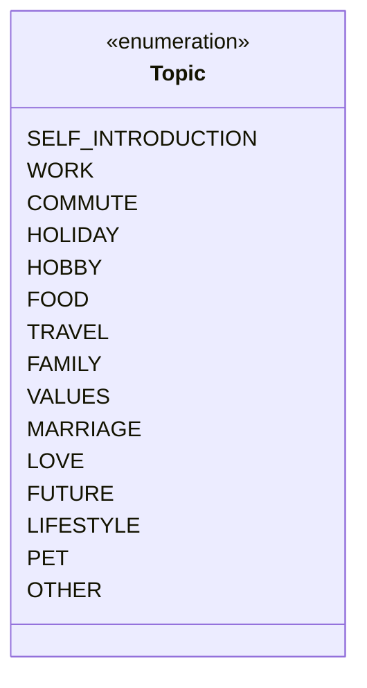
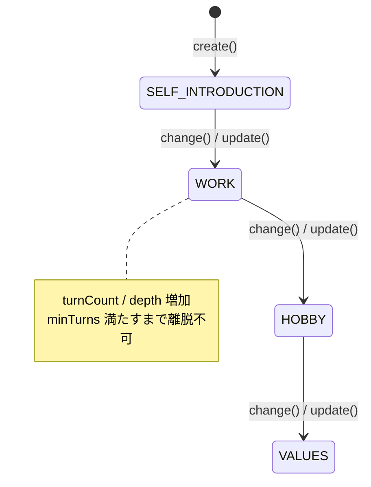
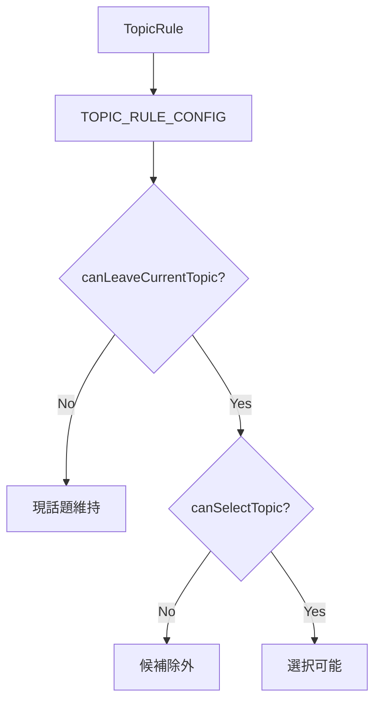
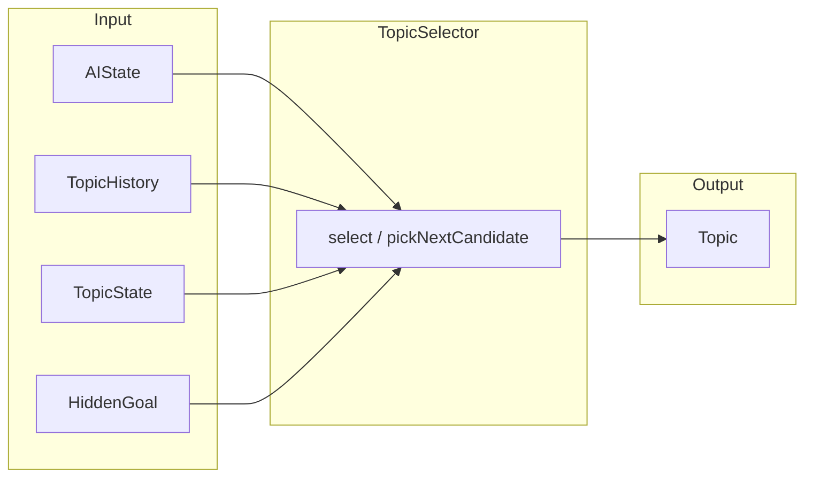
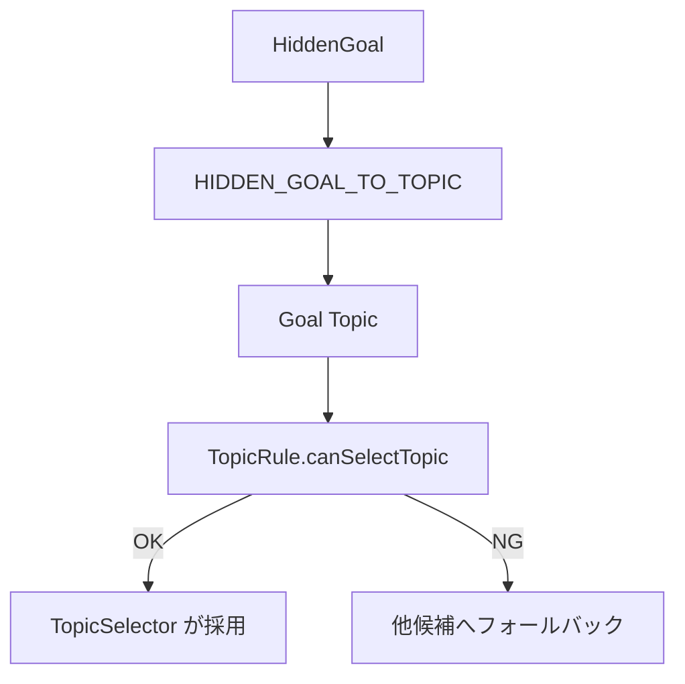
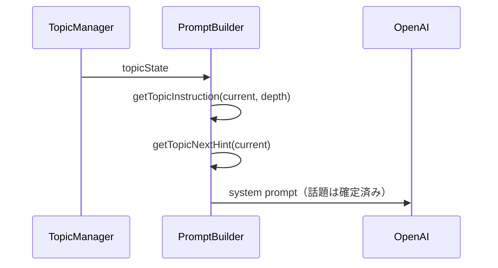
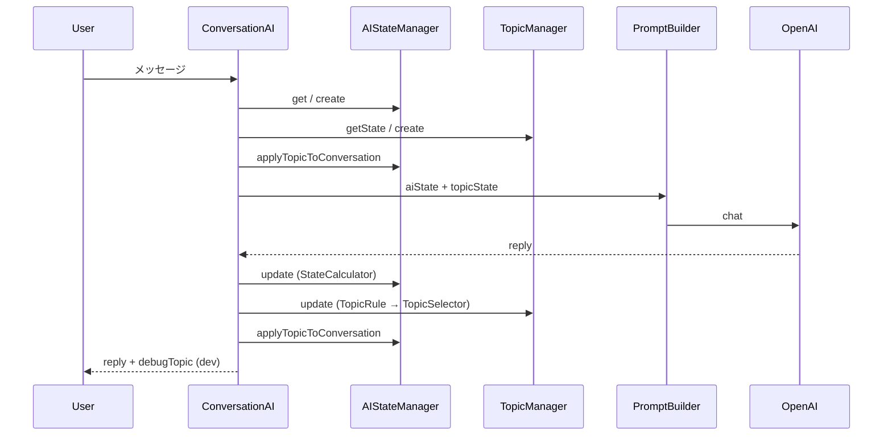
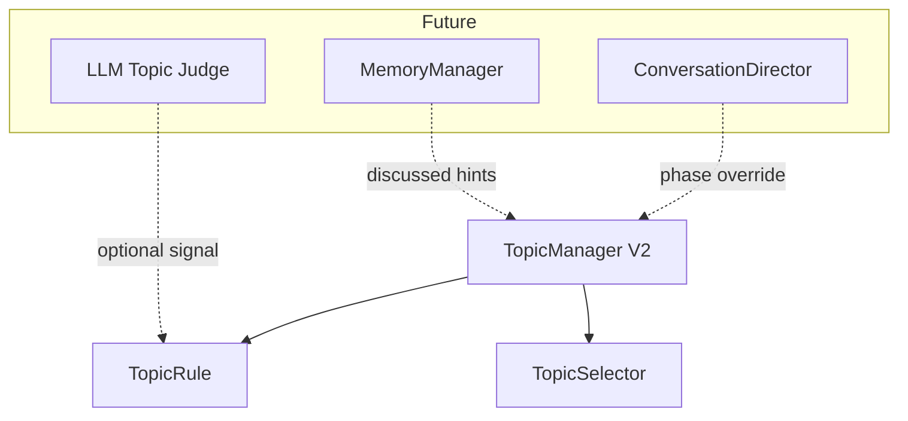
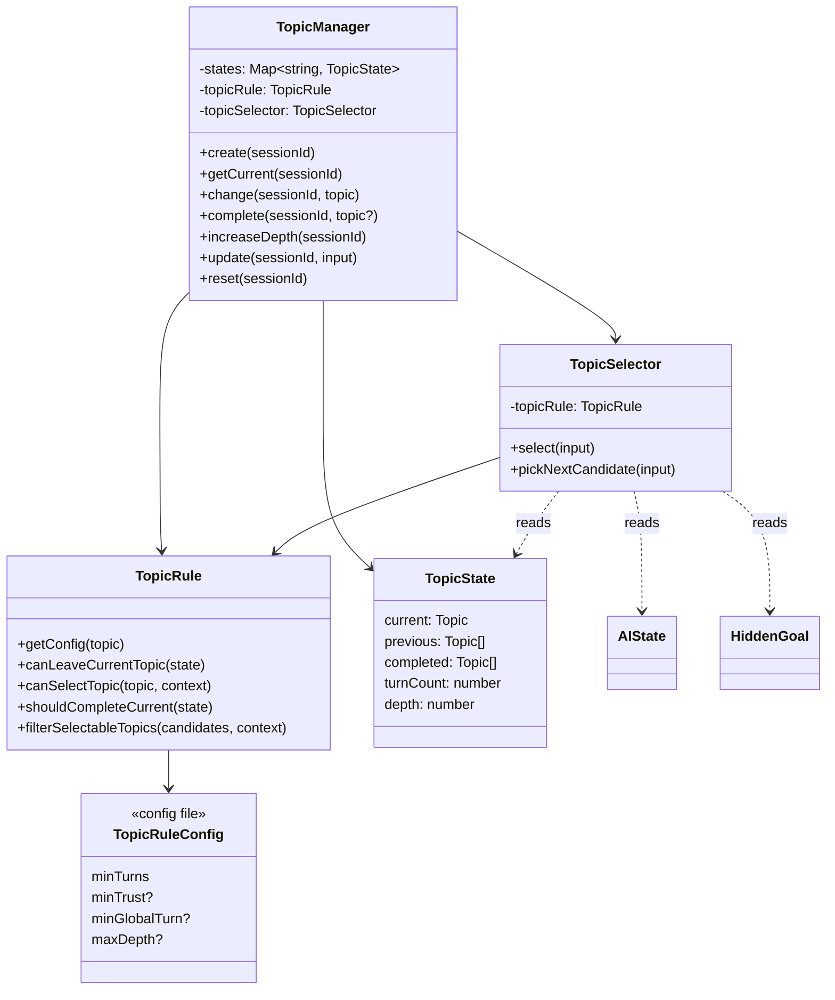
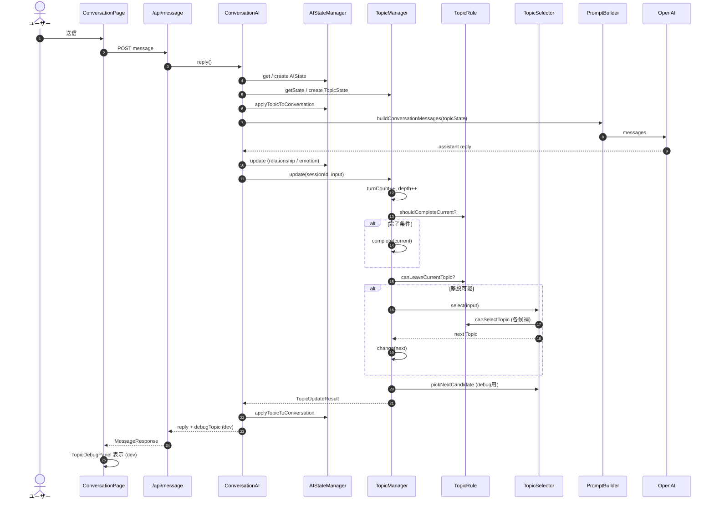

# 17_話題管理設計_V2.md

# 婚活AIトレーナー — TopicManager V2

Version: 2.0 (Phase 2)

---

# 1. Topic一覧

会話全体の話題を **Enum** で管理する。OpenAI に話題選択を委ねず、アプリ側で決定する。

| Enum | ラベル | 概要 |
| --- | --- | --- |
| `SELF_INTRODUCTION` | 自己紹介 | 初回・自己紹介フェーズ |
| `WORK` | 仕事 | 職業・やりがい |
| `COMMUTE` | 通勤・働き方 | 通勤・リモート等 |
| `HOLIDAY` | 休日 | 休日の過ごし方 |
| `HOBBY` | 趣味 | 趣味の深掘り |
| `FOOD` | 食べ物 | 食の好み |
| `TRAVEL` | 旅行 | 旅行の話 |
| `FAMILY` | 家族 | 家族観 |
| `VALUES` | 価値観 | 大切にしていること |
| `MARRIAGE` | 結婚観 | 結婚への考え |
| `LOVE` | 恋愛観 | 恋愛観（終盤寄り） |
| `FUTURE` | 将来 | 将来の展望 |
| `LIFESTYLE` | ライフスタイル | 生活リズム |
| `PET` | ペット | ペット・動物 |
| `OTHER` | その他 | フォールバック |



---

# 2. TopicState

セッションごとに保持する話題状態。

```typescript
interface TopicState {
  current: Topic;       // 現在の話題
  previous: Topic[];  // 直近の話題履歴（変更順）
  completed: Topic[]; // 完了済み話題
  turnCount: number;  // 現在話題でのターン数
  depth: number;      // 現在話題の深掘り度（1始まり）
}
```



---

# 3. TopicRule

話題ごとの制約を `TopicRuleConfig.ts` に分離する。

| 話題 | minTurns | minTrust | minGlobalTurn | maxDepth |
| --- | --- | --- | --- | --- |
| WORK | 3 | — | — | 4 |
| HOBBY | 2 | — | — | 4 |
| LOVE | 2 | 55 | 8（終盤のみ） | 3 |
| MARRIAGE | 2 | 60 | — | 3 |
| VALUES | 3 | 45 | — | 4 |
| その他 | 1〜3 | 状況により | — | 2〜4 |

**主要メソッド**

| メソッド | 責務 |
| --- | --- |
| `canLeaveCurrentTopic()` | 最低ターンを満たしているか |
| `canSelectTopic()` | 信頼度・終盤条件を満たすか |
| `shouldCompleteCurrent()` | 深さ上限または十分なターンで完了 |
| `filterSelectableTopics()` | 候補リストをルールで絞り込み |



---

# 4. TopicSelector

次の話題を決定する。入力はルールベースのみ（LLM 不使用）。

**入力**

| フィールド | 型 |
| --- | --- |
| `aiState` | `AIState` |
| `conversationHistory` | `ConversationHistoryMessage[]` |
| `topicState` | `TopicState` |
| `hiddenGoal` | `HiddenGoal` |

**出力**: `Topic`

**選択優先順位**

1. 現話題の `minTurns` 未達 → 現話題維持
2. HiddenGoal に対応する Topic（ルール通過時）
3. 未完了 Topic からランダム選択
4. 関心・楽しさが高い場合は現話題継続
5. フォールバック（完了済み含む）



---

# 5. HiddenGoal連携

`HIDDEN_GOAL_TO_TOPIC` で HiddenGoal → 優先 Topic をマッピングする。

| HiddenGoal | 優先 Topic |
| --- | --- |
| JOB | WORK |
| HOLIDAY | HOLIDAY |
| VALUE | VALUES |
| MARRIAGE | MARRIAGE |
| FAMILY | FAMILY |
| HOBBY | HOBBY |
| FOOD | FOOD |
| TRAVEL | TRAVEL |
| FUTURE | FUTURE |
| LOVE | LOVE |

TopicSelector は候補選定時に Goal Topic を最優先で検討する（`TopicRule.canSelectTopic` を通過した場合のみ）。



---

# 6. PromptBuilder連携

OpenAI へ渡すプロンプトに以下を埋め込む（話題選択は行わない）。

| プレースホルダ | 内容 |
| --- | --- |
| `topic_instruction` | 現在話題 + 深さ + 深掘り指示 |
| `topic_depth` | `TopicState.depth` |
| `topic_next_hint` | `TOPIC_NEXT_HINTS[current]` |



---

# 7. AIState連携

Topic 更新は **AIState 更新後** に実行する。`AIStateManager` は Topic 選択を行わない。

| タイミング | 処理 |
| --- | --- |
| プロンプト構築前 | `applyTopicToConversation()` で `conversation.currentTopic` を同期 |
| OpenAI 応答後 | `AIStateManager.update()`（StateCalculator） |
| その直後 | `TopicManager.update()` |
| Topic 更新後 | 再度 `applyTopicToConversation()` |



---

# 8. 将来 MemoryManager と連携する方法

今回は未実装。将来の拡張ポイント:

| 連携先 | 想定用途 |
| --- | --- |
| `MemoryManager` | ユーザー発言から話題キーワード抽出 → `completed` 自動マーク |
| `ConversationDirector` | 全体の会話フェーズと Topic 遷移の統合制御 |
| LLM 判定 | 話題完了・感情分析の補助（現状はルールのみ） |



**推奨インターフェース（案）**

```typescript
interface TopicMemorySignal {
  topic: Topic;
  confidence: number;
  source: "keyword" | "llm";
}
// TopicManager.update() の input に optional で追加
```

---

# 9. クラス図



---

# 10. シーケンス図（1ターン）



---

# MVP互換

| MVP API | V2 対応 |
| --- | --- |
| `getCurrentTopic()` | `getCurrent()` のエイリアス |
| `changeTopic()` | `change()` + `TopicHistory` 変換 |
| `getTopicHistory()` | `TopicState` → `TopicHistory` |
| `markDiscussed()` | `complete()` |
| `canAsk()` | `TopicRule.getMinTurns` 参照 |
| `incrementTurnCount()` | `update()` 内で統合（互換用に残存） |
