# 18_記憶管理設計_V2.md

# 婚活AIトレーナー — MemoryManager V2

Version: 2.0 (Phase 3)

---

# 1. Memory構造

会話から抽出した情報を構造化して保持する。`ConversationHistory` をそのままプロンプトに渡すのではなく、必要な事実だけを `Memory` として管理する。

```typescript
interface Memory {
  id: string;
  category: MemoryCategory;
  importance: number;        // 0-100
  value: string;             // 表示用テキスト
  createdTurn: number;
  lastReferencedTurn: number;
}
```

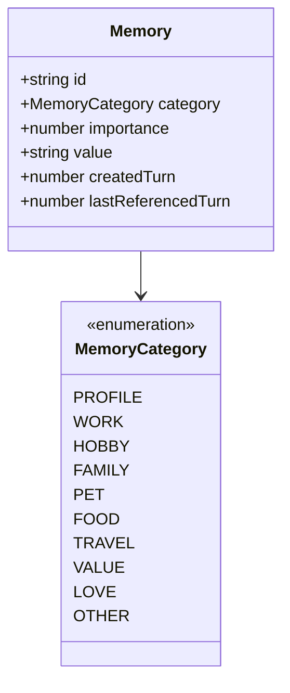

---

# 2. ShortTermMemory

**今回の会話だけ**保持する一時記憶。

| 例 | カテゴリ | scope |
| --- | --- | --- |
| 今日は休み | OTHER | short |
| 昨日旅行へ行った | TRAVEL | short |
| 先週映画を見た | OTHER | short |

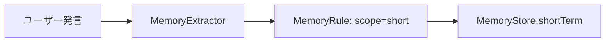

---

# 3. LongTermMemory

**プロフィールとして**保持する長期記憶。

| 例 | カテゴリ | scope |
| --- | --- | --- |
| 犬を飼っている | PET | long |
| 営業職 | WORK | long |
| 奈良県在住 | PROFILE | long |
| ゲームが好き | HOBBY | long |

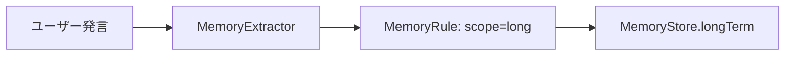

**MemoryStore**

```typescript
interface MemoryStore {
  shortTerm: Memory[];
  longTerm: Memory[];
}
```

---

# 4. MemoryRule

抽出・重複排除・関連度スコアのルールを集約する。`MemoryManager` に判定ロジックを書かない。

| 責務 | メソッド |
| --- | --- |
| パターンマッチ抽出 | `extractFromText()` |
| 重複判定 | `shouldAdd()` / `isDuplicate()` |
| プロンプト用スコア | `scoreRelevance()` |
| 表示整形 | `formatForPrompt()` |

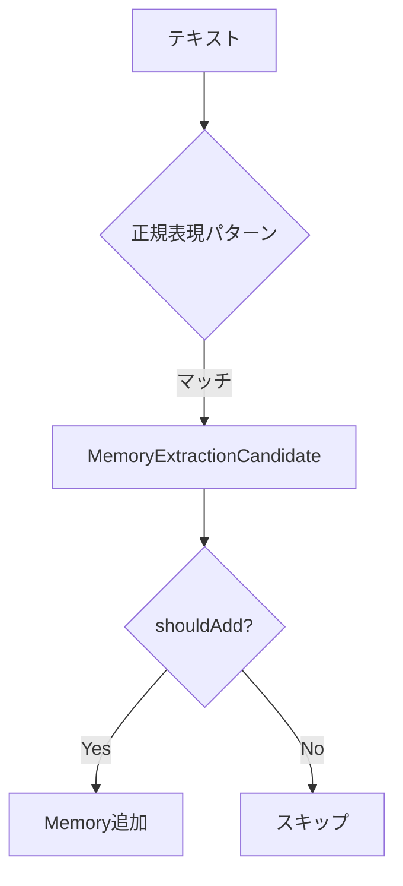

---

# 5. MemoryExtractor

`ConversationHistory` と最新ユーザー発言から、保存すべき情報だけを抽出する。

**入力**

| フィールド | 説明 |
| --- | --- |
| `userMessage` | 最新ユーザー発言 |
| `assistantMessage` | 最新AI返答 |
| `conversationHistory` | 会話履歴 |
| `currentTurn` | 現在ターン |

**出力**: `MemoryExtractionCandidate[]`

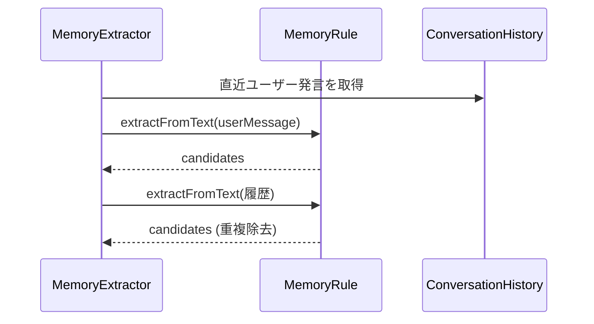

---

# 6. MemoryManager

セッション単位で Memory を管理する。

| メソッド | 責務 |
| --- | --- |
| `create()` | 空の MemoryStore 生成 |
| `add()` | 候補から Memory 追加 |
| `updateMemory()` | 個別 Memory の更新 |
| `remove()` | Memory 削除 |
| `search()` | プロンプト用の関連 Memory 取得 |
| `getAll()` | short / long 一覧 |
| `clear()` | セッション記憶クリア |
| `update()` | Extractor 実行 → 追加（毎ターン） |

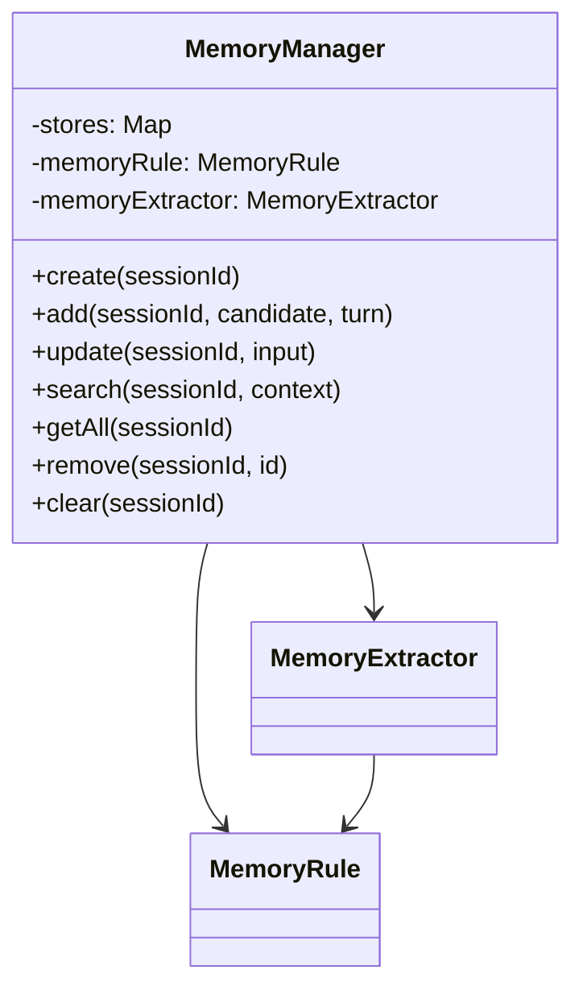

---

# 7. PromptBuilder連携

`ConversationAI` が `search()` で取得した Memory を `relevantMemories` として渡す。

**system.md プレースホルダ**

| キー | 内容 |
| --- | --- |
| `{{relevant_memories}}` | 覚えていること（箇条書き） |

**例**

```
覚えていること
・犬を飼っている
・旅行が好き
・奈良県在住
```

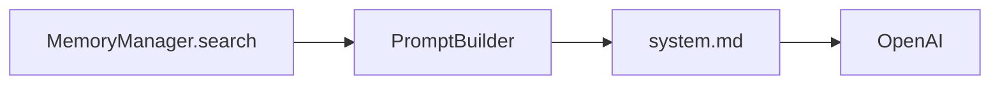

---

# 8. AIState連携

`AIStateManager` は Memory のライフサイクルを委譲するのみ。

| タイミング | 処理 |
| --- | --- |
| `create()` | `MemoryManager.create()` |
| `reset()` | `MemoryManager.clear()` |
| 毎ターン | `ConversationAI` が `MemoryManager.update()` を呼ぶ |

Memory 更新は `StateCalculator` とは独立。心理状態と記憶は分離する。

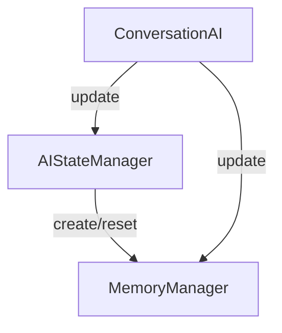

---

# 9. TopicManager連携

`search()` 時に現在の `Topic` と `MemoryCategory` の対応で関連度をブーストする。

| MemoryCategory | Topic |
| --- | --- |
| WORK | WORK |
| HOBBY | HOBBY |
| FAMILY | FAMILY |
| PET | PET |
| TRAVEL | TRAVEL |
| VALUE | VALUES |
| LOVE | LOVE |
| PROFILE | SELF_INTRODUCTION |

将来: Memory から `TopicManager.complete()` への自動マーク連携が可能。

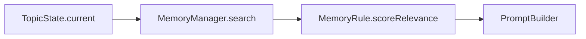

---

# 10. 将来 ConversationDirector と連携する方法

今回は未実装。`15_会話ディレクター設計.md` の更新フローに組み込む想定。

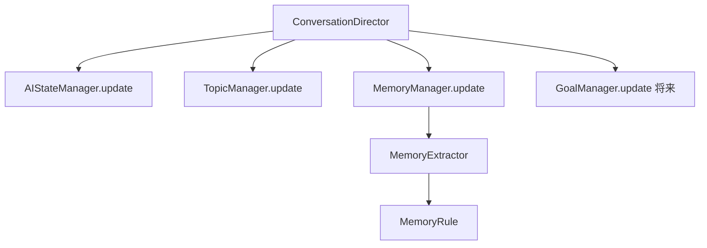

**拡張ポイント**

| 項目 | 内容 |
| --- | --- |
| DB 永続化 | `ConversationSession.memory` JSON へ同期 |
| ベクトル検索 | `search()` を embedding ベースに差し替え |
| LLM 抽出 | `MemoryExtractor` に LLM バックエンド追加 |
| Director 制御 | 更新順序・スキップ条件を Director が一元管理 |

---

# 11. クラス図

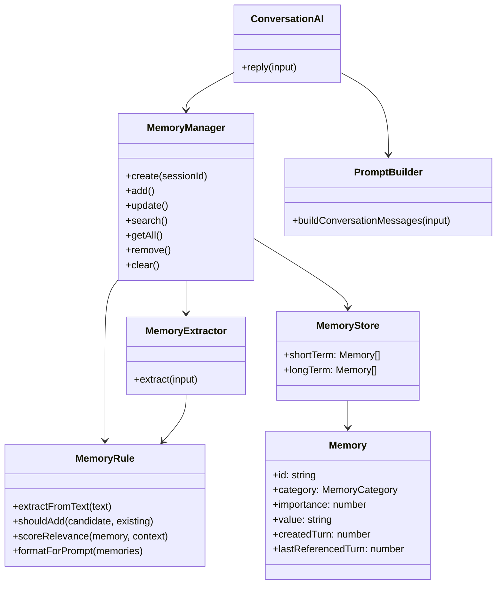

---

# 12. シーケンス図（1ターン）

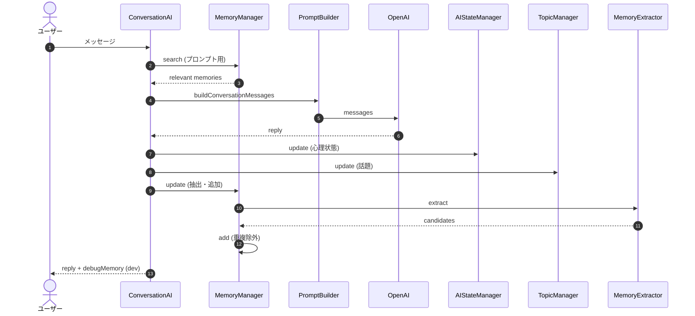

---

# MVP互換

| 項目 | 対応 |
| --- | --- |
| セッション内メモリ | インメモリ Map で保持（DB 未実装） |
| 旧 Fact/Insight 設計 | V2 `Memory` 構造で代替（別型） |
| ConversationHistory | 引き続き OpenAI へ渡す（Memory は補助） |
| 抽出方式 | ルールベースのみ（LLM 未使用） |
