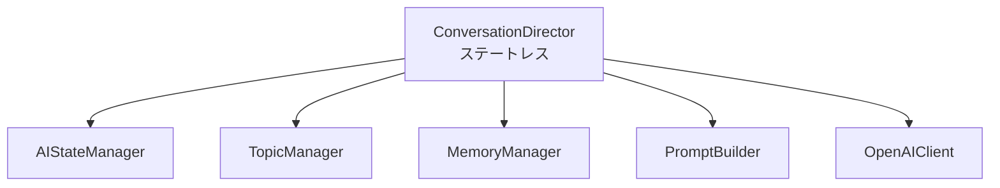
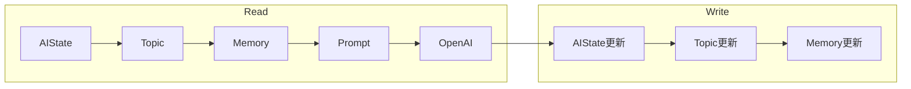
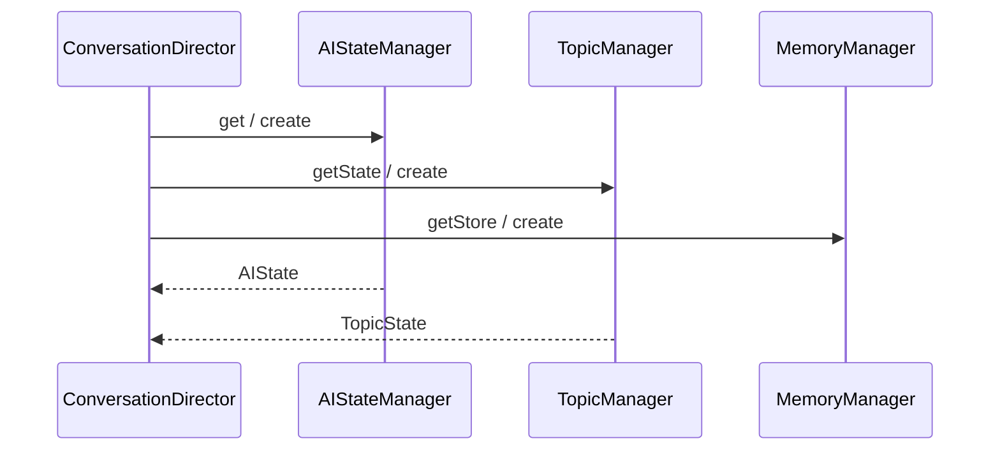
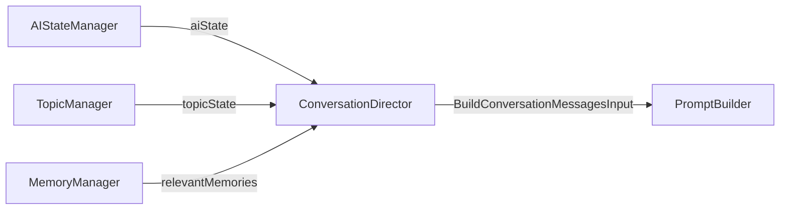
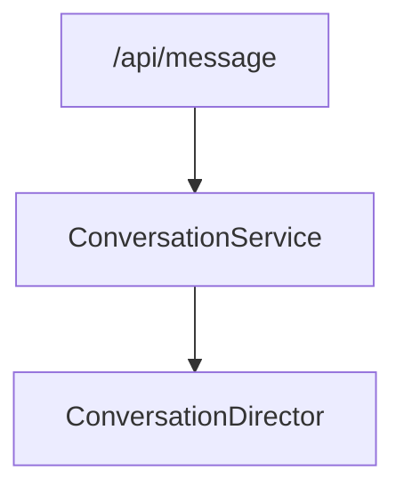
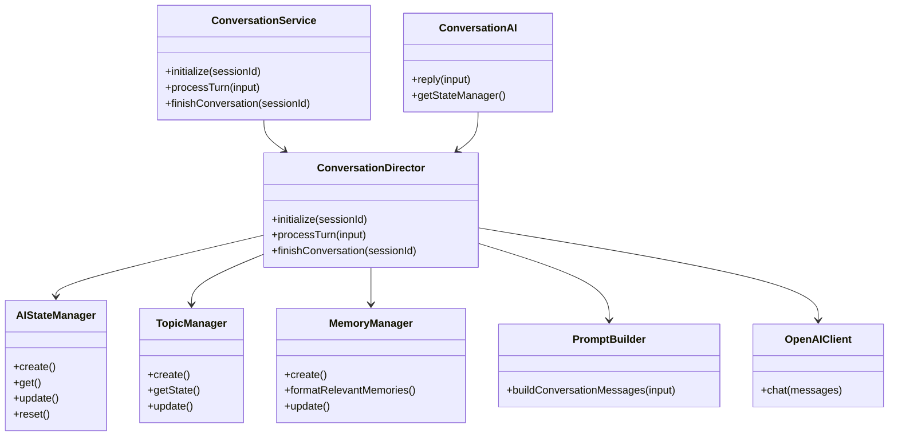
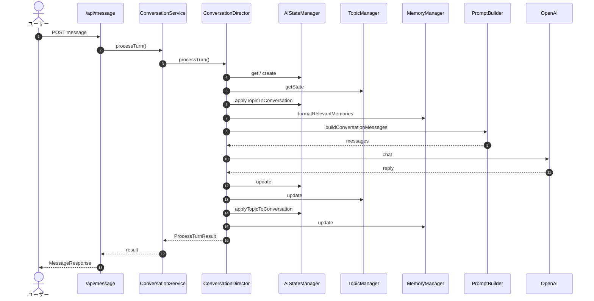

# 19_会話ディレクター設計_V2.md

# 婚活AIトレーナー — ConversationDirector V2

Version: 2.0 (Phase 4)

---

# 1. 責務

**ConversationDirector** は AI 会話エンジン全体の**司令塔（Orchestrator）**である。

| 責務 | 説明 |
| --- | --- |
| オーケストレーション | 1ターンの処理フローを定義し、各 Manager を順番に呼び出す |
| 情報の集約 | Manager から取得した状態を PromptBuilder 入力にまとめる |
| OpenAI 呼び出し | PromptBuilder → OpenAIClient の実行 |
| 更新フロー制御 | 返答後の State / Topic / Memory 更新順序を管理 |
| セッション初期化 | `initialize()` で各 Manager の `create()` を委譲 |

## 責務外（禁止事項）

| 禁止 | 理由 |
| --- | --- |
| 状態の保持 | 状態の正は各 Manager が持つ |
| ビジネスロジック | 心理計算・話題選択・記憶抽出は各 Manager / Rule が担当 |
| Prompt 文字列生成 | PromptBuilder の責務 |
| Manager 同士の直接呼び出し | Director のみが Manager を呼ぶ |



---

# 2. 全体フロー

```text
【会話開始】
ConversationDirector.initialize()
    → AIStateManager / TopicManager / MemoryManager.create()

【各ターン】
ConversationDirector.processTurn()
    読み取り: State → Topic → Memory → Prompt → OpenAI
    更新:     State → Topic → Memory
    返答

【会話終了】
ConversationDirector.finishConversation()
    → リソース解放（reset）
```



---

# 3. processTurn()

## 入力

| フィールド | 型 |
| --- | --- |
| `session` | `Session` |
| `conversationHistory` | `ConversationHistoryMessage[]` |
| `userMessage` | `string` |

## 処理順序

| 順序 | 処理 | 委譲先 |
| --- | --- | --- |
| ① | AIState 取得 | `AIStateManager.get()` / `create()` |
| ② | Topic 取得 | `TopicManager.getState()` |
| ③ | RelevantMemory 取得 | `MemoryManager.formatRelevantMemories()` |
| ④ | Prompt 生成 | `PromptBuilder.buildConversationMessages()` |
| ⑤ | OpenAI 呼び出し | `OpenAIClient.chat()` |
| ⑥ | AIState 更新 | `AIStateManager.update()` |
| ⑦ | Topic 更新 | `TopicManager.update()` |
| ⑧ | Memory 更新 | `MemoryManager.update()` |
| ⑨ | 返答 | `ProcessTurnResult` |

## 出力

```typescript
interface ProcessTurnResult {
  reply: string;
  shouldEnd: boolean;
  turn: number;
  debugState?: AIState;      // development のみ
  debugTopic?: TopicDebugSnapshot;
  debugMemory?: MemoryDebugSnapshot;
}
```

---

# 4. initialize()

会話開始時（または初回ターン前）に各 Manager の状態を準備する。

```typescript
initialize(sessionId: string): InitializeResult
```

| 呼び出し | 内容 |
| --- | --- |
| `AIStateManager.create()` | 心理状態・HiddenGoal 初期化 |
| `TopicManager.create()` | TopicState 初期化 |
| `MemoryManager.create()` | MemoryStore 初期化 |

`processTurn()` 内でも未初期化時に `initialize()` 相当の処理を行う（冪等）。



---

# 5. finishConversation()

会話終了時のリソース解放。

```typescript
finishConversation(sessionId: string): FinishConversationResult
```

| 処理 | 内容 |
| --- | --- |
| 最終ターン取得 | `AIStateManager.get()` |
| リセット | `AIStateManager.reset()`（Topic / Memory も連動クリア） |

将来: EvaluationManager 呼び出しをここに追加可能。

---

# 6. Managerとの連携

Director は **唯一** Manager を呼び出す層である。

```mermaid
classDiagram
    class ConversationDirector {
        -aiStateManager
        -topicManager
        -memoryManager
        -promptBuilder
        -openAIClient
        +initialize(sessionId)
        +processTurn(input)
        +finishConversation(sessionId)
    }

    ConversationDirector --> AIStateManager
    ConversationDirector --> TopicManager
    ConversationDirector --> MemoryManager

    note for ConversationDirector
        状態を保持しない
        すべて Manager へ委譲
    end note
```

| Manager | Director からの操作 |
| --- | --- |
| AIStateManager | `get` / `create` / `update` / `applyTopicToConversation` / `reset` |
| TopicManager | `getState` / `create` / `update` |
| MemoryManager | `getStore` / `create` / `formatRelevantMemories` / `update` / `getAll` |

**禁止**: Manager → Manager の直接呼び出し（Director 経由のみ）

---

# 7. PromptBuilderとの連携

PromptBuilder は **Director から渡されたデータのみ** を使用する。自身で Manager を呼ばない。

| 入力 | 説明 |
| --- | --- |
| `session` | セッション・プロフィール |
| `aiState` | 心理状態（同期済み） |
| `topicState` | 現在話題・深さ |
| `relevantMemories` | 関連 Memory（整形済み文字列） |
| `conversationHistory` | 会話履歴 |
| `latestMessage` | 最新ユーザー発言 |



---

# 8. ConversationServiceとの連携

`ConversationService` は **ConversationDirector のみ** を呼び出す。Manager を直接呼ばない。



| ConversationService | 委譲先 |
| --- | --- |
| `initialize()` | `director.initialize()` |
| `processTurn()` | `director.processTurn()` |
| `finishConversation()` | `director.finishConversation()` |

**ConversationAI** は API 互換用の薄いファサードとして `director.processTurn()` へ委譲。

```text
【目標アーキテクチャ】
API Route → ConversationService → ConversationDirector → Managers
Client    → MessageService → API Route
```

---

# 9. クラス図



---

# 10. シーケンス図（1ターン）



---

# MVP互換

| 項目 | 対応 |
| --- | --- |
| `ConversationAI.reply()` | `processTurn()` へ委譲（既存 API 互換） |
| `MessageService` | 変更なし（クライアント → API） |
| `ConversationPage` | 変更なし |
| Manager 直接呼び出し | API Route から除去、Director 経由に統一 |
