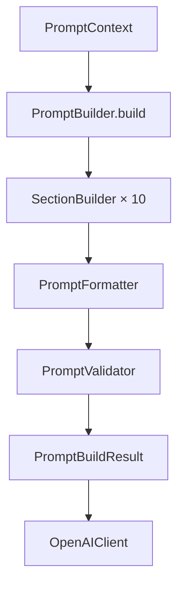
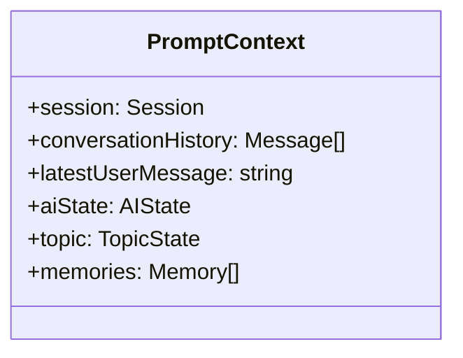
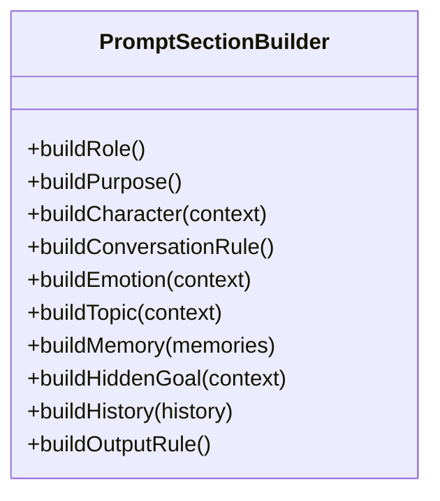
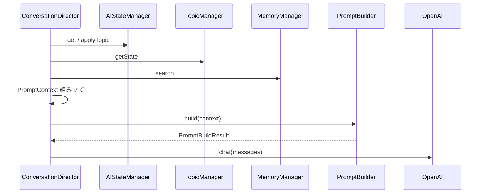
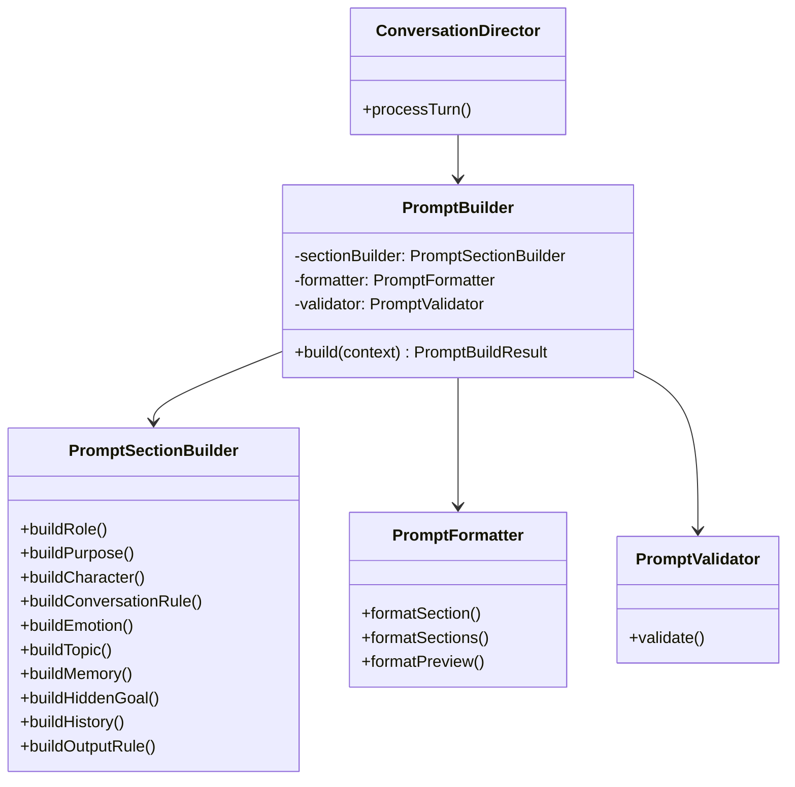
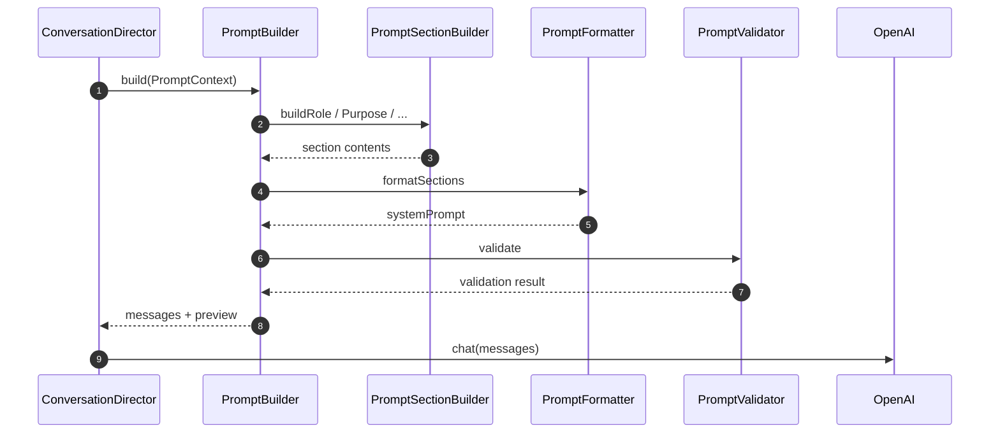

# 20_プロンプトビルダー設計_V2.md

# 婚活AIトレーナー — PromptBuilder V2

Version: 2.0 (Phase 5)

---

# 1. Prompt構造

PromptBuilder は **ConversationDirector から渡された `PromptContext` のみ** を利用し、完成したプロンプトを生成する。

## 1.1 セクション順序

| 順序 | セクション | 内容 |
| --- | --- | --- |
| ① | 役割 | 婚活女性として振る舞う |
| ② | 目的 | 婚活会話の再現 |
| ③ | AI女性設定 | Session プロフィール |
| ④ | 会話ルール | 質問・距離感・話題遷移 |
| ⑤ | 心理状態 | AIState を自然文で |
| ⑥ | 話題 | Topic・深さ・次に知りたいこと |
| ⑦ | 記憶 | Relevant Memory（最大5件） |
| ⑧ | Hidden Goal | 会話目標 |
| ⑨ | 会話履歴 | 直近15ターン（APIメッセージ列） |
| ⑩ | 出力ルール | 返答形式の制約 |

## 1.2 OpenAI への送信形式

```text
system  … セクション ①〜⑧ + ⑩
messages … 会話履歴（最大15ターン）
user    … 最新ユーザー入力
```



---

# 2. Section一覧

| ID | メソッド | データソース |
| --- | --- | --- |
| `role` | `buildRole()` | 固定文言 |
| `purpose` | `buildPurpose()` | 固定文言 |
| `character` | `buildCharacter()` | `session.homeForm` |
| `conversationRule` | `buildConversationRule()` | 固定ルール |
| `emotion` | `buildEmotion()` | `aiState` |
| `topic` | `buildTopic()` | `topic` (TopicState) |
| `memory` | `buildMemory()` | `memories`（importance上位5） |
| `hiddenGoal` | `buildHiddenGoal()` | `aiState.hiddenGoal` |
| `history` | `buildHistory()` | `conversationHistory` |
| `outputRule` | `buildOutputRule()` | 固定文言 |

---

# 3. Context

```typescript
interface PromptContext {
  session: Session;
  conversationHistory: ConversationHistoryMessage[];
  latestUserMessage: string;
  aiState: AIState;
  topic: TopicState;
  memories: Memory[];
}
```

**原則**: PromptBuilder は Manager を呼ばない。Context に必要な情報がすべて含まれる。



---

# 4. SectionBuilder

`PromptSectionBuilder` が各セクションの文言生成を担当する。



Version3 以降は Section を追加するだけで拡張可能。

---

# 5. Validator

`PromptValidator` が送信前チェックを行う。

| チェック | コード | 内容 |
| --- | --- | --- |
| プロンプトサイズ | `PROMPT_TOO_LARGE` | 28,000文字上限 |
| 空セクション | `EMPTY_SECTION` | content が空 |
| 重複 Memory | `DUPLICATE_MEMORY` | 同一 value |
| 履歴件数 | `HISTORY_LIMIT_EXCEEDED` | 15ターン超過 |
| Topic 存在 | `TOPIC_MISSING` | Topic 未設定 |

```typescript
interface PromptValidationResult {
  valid: boolean;
  issues: PromptValidationIssue[];
  stats: { promptSize, sectionCount, historyTurns, memoryCount };
}
```

---

# 6. Formatter

`PromptFormatter` が Markdown 形式でセクションを整形する。

```markdown
## 役割

あなたは婚活中の女性です。
...

---

## 目的
...
```

Development モードでは `preview` に全セクション + API送信内容を含む全文を生成する。

---

# 7. ConversationDirector連携

Director は `promptBuilder.build(context)` **のみ** 呼び出す。



---

# 8. 将来 Version3 で追加予定の Section

| Section | 概要 |
| --- | --- |
| `evaluationHint` | 評価観点の内部ヒント |
| `emotionAnalysis` | LLM 感情解析結果 |
| `longTermMemory` | セッション跨ぎ記憶 |
| `conversationPhase` | 会話フェーズ（導入・深掘り・終盤） |
| `safetyGuard` | セーフティ・NGワード |

拡張方法:

```typescript
sections.push({
  id: "conversationPhase",
  title: "会話フェーズ",
  content: sectionBuilder.buildConversationPhase(context),
});
```

---

# 9. クラス図



---

# 10. シーケンス図



---

# MVP互換

| 項目 | 対応 |
| --- | --- |
| 旧 `buildConversationMessages()` | `build()` に統合 |
| 旧 `system.md` テンプレート | SectionBuilder へ移行（ファイルは残置可） |
| `src/ai/PromptBuilder.ts` | 新モジュールへの re-export |
| Debug UI | `PromptDebugPanel`（development のみ） |
